# Data Collection

本課程實作如何將資料（如價量、基本面、籌碼面...等）ingest 到 zipline 回測引擎中。

透過這個動作，後續使用 Pipeline API 時，就可以很有效率地獲取資料並計算因子。

### 載入所需套件

```
import os
import pandas as pd
import numpy as np
```
## Bundle設置

介紹環境變數（environ）設定、運用設定的環境變數做價量、非價量資料的 bundle。

* 在 import zipline 前，必須先設定 `TEJAPI_BASE` 與 `TEJAPI_KEY`。

#### os.environ 變數設定:

<u>設置價量資料 bundle（tquant bundle）需要的資訊：</u>
* os.environ['TEJAPI_BASE'] = "https://api.tej.com.tw" <br>
        用於連結TEJ資料庫

* os.environ['TEJAPI_KEY'] = "Your_Key"<br>
        用於識別使用者
* os.environ['ticker']<br>
        tickers = 'xxxx xxxx xxxx'
        os.environ['ticker'] = tickers 
        設置我們所需要的股票代碼  
* os.environ['mdate'] = 'yyyymmdd yyyymmdd'<br>
        設置取得資料的起始時間與結束時間
* !zipline ingest -b tquant
        將上方資料 ingest 進 bundle。

<u>設置非價量資料 bundle（fundamentals bundle）需要的資訊：</u>
* os.environ['fields'] = 'field1, field2, field3'<br>
        設置撈取非價量資料的欄位，其中 field1、field2、field3 代表資料欄位名稱 
* os.environ['include_self_acc'] = 'N'(預設)<br>
        設置是否涵蓋公司自結財務，其中設定'Y'代表財務資料包含自結財務，'N'則表示不包含
         
* !zipline ingest -b fundamentals
        將非價量資料 ingest 進 bundle。

### 價量資料
* 價量資料係指單純 OHLCV 與除權息相關資訊。

載入指定股票的價量資料，其中 IR0001 為台灣發行量加權股價報酬指數。

```
tickers = 'IR0001 0050 0056 00737 1108 1101 1102 1103 6243 6451 1216 1301 1303 1326 1402 1476 1590 1605 1722 1802 2002 2105 2201 2207 2227 2301 2939 4108 4148 6431 6541 6657 2883 2891 2543 2929 2303 6505 9926 2308 2311 2317 2324 2325 2327 2330 2347 2353 2354 2357 2379 2382 2395 2408 2409 2412 2448 2454 2474 2492 2498 2603 2609 2615 2618 2633 2801 2823 2880 2881 2882 2883 2884 2885 2886 2887 2888 2890 2891 2892 2912 3008 3009 3034 3037 3045 3231 3474 3481 3673 3697 3711 4904 4938 5854 5871 5876 5880 6239 6415 6505 6669 6770 8046 8454 9904 9910'
print("總共有 :",len(tickers.split()),"筆資料")
```


```
os.environ["TEJAPI_BASE"] = 'https://api.tej.com.tw'
os.environ['TEJAPI_KEY'] = "Your_Key"
os.environ['ticker'] = tickers
os.environ['mdate'] = '20200103 20230530'

!zipline ingest -b tquant
```

### 更新價量資料

透過輸入 `zipline update -b tquant` 指令，可以更新當前使用的 tquant bundle，以獲得最新的交易價格和交易量資訊。

```
# 執行前
!zipline bundle-info
```
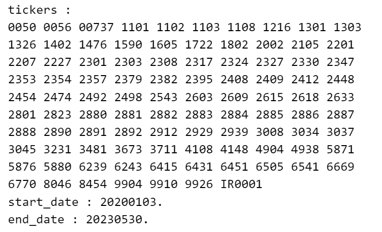

```
!zipline update -b tquant
```
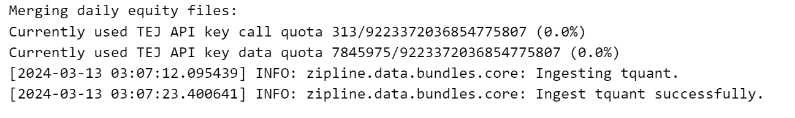

```
# 執行後
!zipline bundle-info
```
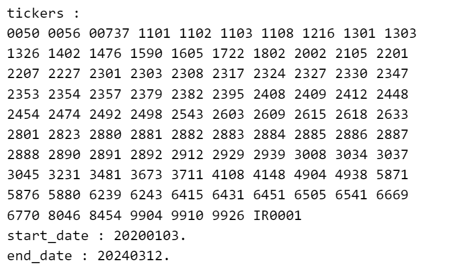

### 新增價量資料

使用 `zipline add -t <tickers_want_to_add>` 指令，可以向現有的 tquant bundle 中新增所選的股票。

```
# 執行前
!zipline bundle-info
```
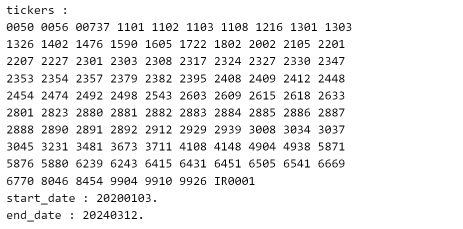

```
!zipline add -t "6523 6208"
```
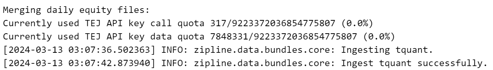

```
# 執行後
!zipline bundle-info
```
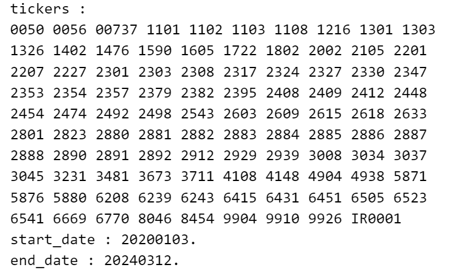

### 非價量資料
* 欄位對照清單可參考[TQuant官方網站](https://tquant.tejwin.com/%e8%b3%87%e6%96%99%e9%9b%86/)最下方的 TEJ TOOL API `欄位對照清單`。

設定完 `os.environ['fields']` 後，便可使用 `!zipline ingest -b fundamentals` 載入所需要的非價量資料。

```
columns = ['Sales_Growth_Rate','Operating_Income_Growth_Rate', 
           'Pre_Tax_Income_Growth_Rate','Net_Income_Growth_Rate',
           'Industry_Eng','Industry', 'roi', 'YoY_Monthly_Sales','mktcap']
```

```
os.environ['fields'] = " ".join(columns)
!zipline ingest -b fundamentals
```
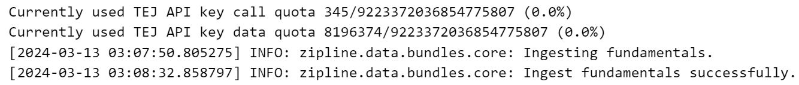

### 更新非價量資料

透過輸入 `zipline update -b tquant` 指令，可以更新當前使用的 fundamentals bundle，以獲得最新的資訊。

```
## update 前
from zipline.data.data_portal import get_fundamentals
df = get_fundamentals()
print('股票池為:',df['symbol'].unique())
print('起始日:',df['date'].min())
print('結束日:',df['date'].max())
print('欄位:',df.columns)
```
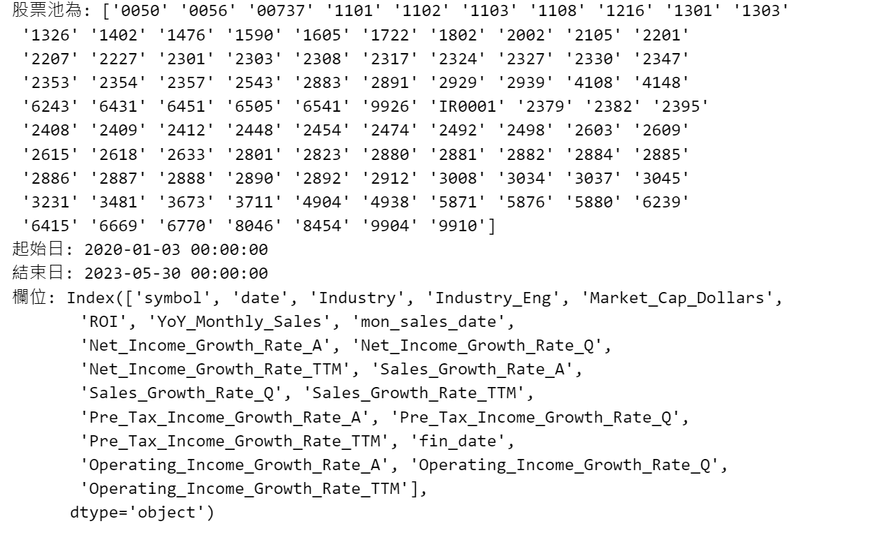

```
!zipline update -b fundamentals
```
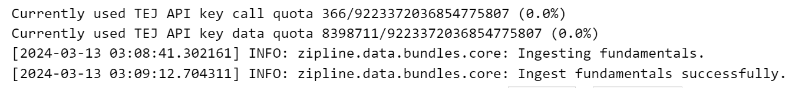

```
# update 後
df = get_fundamentals()
print('股票池為:',df['symbol'].unique())
print('起始日:',df['date'].min())
print('結束日:',df['date'].max())
print('欄位:',df.columns)
```
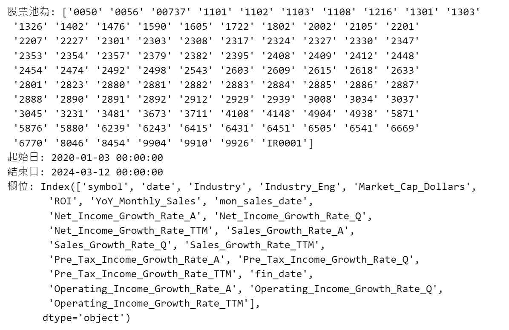

### 新增非價量資料

- 執行指令 `zipline add -b fundamentals -t <tickers_want_to_add>` 可以根據當前 fundamentls bundle 的欄位，新增所選擇的公司到 bundle 中。

- （fundamentls bundle 限定）透過指令 `!zipline add -b fundamentals -f <columns_want_to_add>`（其中 `-f` 代表 `field`）來新增當前已有公司的指定資料欄位。

- 請注意，目前系統不支援同時新增公司和資料欄位，因此需要分別進行這些操作。

```
# add 公司
!zipline add -b fundamentals -t "6523 6208"
```
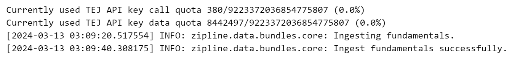

```
# add 公司後
df = get_fundamentals()
print('股票池為:',df['symbol'].unique())
print('起始日:',df['date'].min())
print('結束日:',df['date'].max())
print('欄位:',df.columns)
```
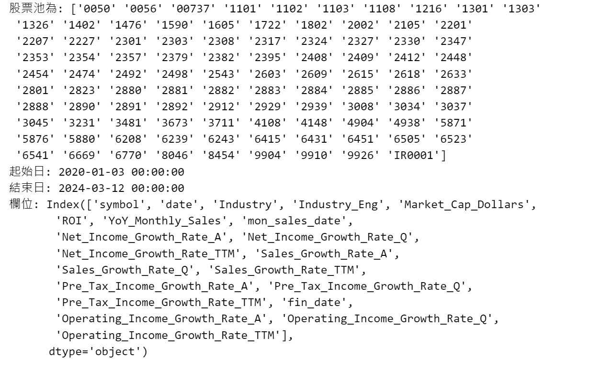

```
# add 欄位
!zipline add -b fundamentals -f Gross_Margin_Growth_Rate
```
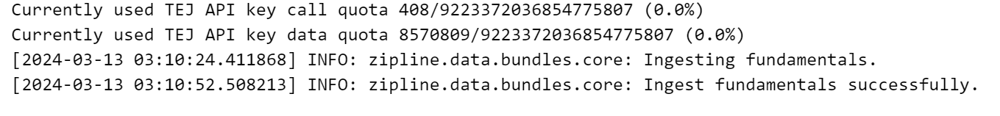

```
# add 欄位後
df = get_fundamentals()
print('股票池為:',df['symbol'].unique())
print('起始日:',df['date'].min())
print('結束日:',df['date'].max())
print('欄位:',df.columns)
```
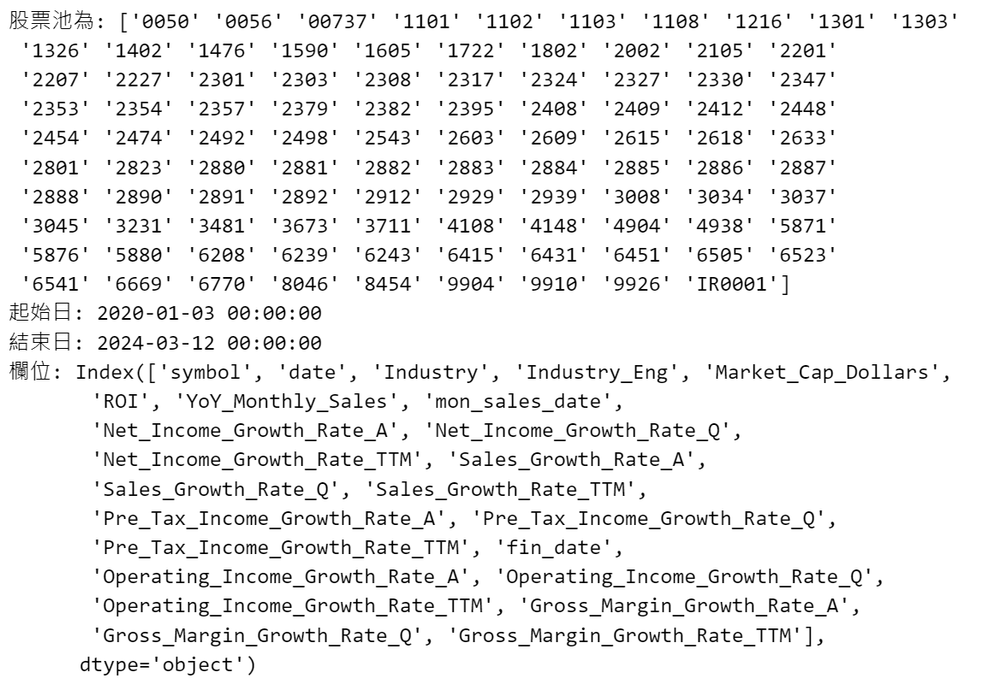

