# Target Percent Pipeline Algorithm

利用pipeline提供的買賣清單與持股權重進行定期再平衡的演算法。

<span id="menu"></span>
本文件包含以下部份：

**基本設定**
1. [Set Environment Variables](#Env)
2. [Investment Universe](#Universe)
3. [Ingest](#Ingest)
4. [Imports](#Imports)
5. [Pipeline](#Pipeline)

**參數說明與範例**

6. [API Reference](#APIReference)：參數說明。
   - [class zipline.algo.pipeline_algo.TargetPercentPipeAlgo](#APIReference)
   - [class zipline.api.date_rules](#date_rules)


7. [Examples](#Examples)：範例。
   - [Case 1－調整start_session與end_session](#Case1)
   - [Case 2－調整max_leverage](#Case2)
   - [Case 3－調整tradeday](#Case3)
   - [Case 4－調整rebalance_date_rule](#Case4)
   - [Case 5－調整slippage_model](#Case5)
   - [Case 6－調整stocklist](#Case6)
   - [Case 7－調整order_filling_policy](#Case7)
   - [Case 8－調整allow_short](#Case8)
   - [Case 9－調整cancel_datedelta](#Case9)   
   - [Case 10－調整limit_buy_multiplier](#Case10)  
   - [Case 11－調整custom_weight、analyze、record_vars、get_record_vars與get_transaction_detail](#Case11)   

<span id="Env"></span>
# 1. Set Environment Variables
[Return to Menu](#menu)

```
import pandas as pd
import datetime
import tejapi
import os

# set tej_key and base
os.environ['TEJAPI_KEY'] = "your key" 
os.environ['TEJAPI_BASE'] = "https://api.tej.com.tw"

# set benchmark
benchmark=['IR0001']

# set calendar
calendar_name='TEJ_XTAI'

# set bundle name
bundle_name = 'tquant'

# set date
start='2023-06-01'
end='2023-10-03'

# 由文字型態轉為Timestamp，供回測使用
tz = 'UTC'
start_dt, end_dt = pd.Timestamp(start, tz = tz), pd.Timestamp(end, tz = tz)

# 設定os.environ['mdate'] = start+' '+end，供ingest bundle使用
os.environ['mdate'] = start+' '+end
```

<span id="Universe"></span>
# 2. Investment Universe

台灣50指數成分股

[Return to Menu](#menu)

```
from zipline.sources.TEJ_Api_Data import get_universe

StockList = get_universe(start, end, idx_id='IX0002')

print(len(StockList))
```
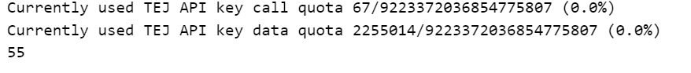

```
os.environ['ticker'] = ' '.join(StockList + benchmark)
```

```
os.environ['ticker']
```

<span id="Ingest"></span>
# 3. Ingest
[Return to Menu](#menu)

```
# Ingest pricing bundle
!zipline ingest -b tquant
```
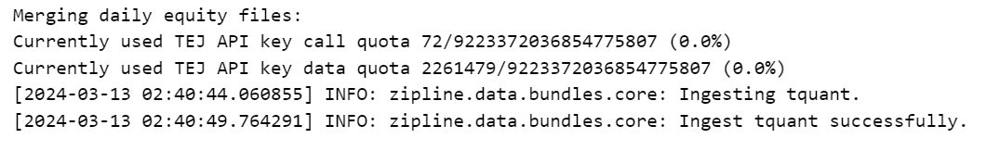

```
from zipline.data.data_portal import get_bundle_price

df_bundle_price = get_bundle_price(bundle_name=bundle_name,
                                   calendar_name=calendar_name,
                                   start_dt=start_dt,
                                   end_dt=end_dt)
```

<span id="Imports"></span>
# 4. Imports & Settings
[Return to Menu](#menu)

```
import warnings
warnings.filterwarnings('ignore')
```
```
from time import time
import numpy as np
import pandas as pd
import empyrical as ep

from logbook import Logger, StderrHandler, INFO, WARNING
import matplotlib.pyplot as plt
from matplotlib.ticker import MaxNLocator


from TejToolAPI.TejToolAPI import *

from zipline.api import record

from zipline.utils.calendar_utils import get_calendar
from zipline.utils.run_algo import  (get_transaction_detail,
                                     get_record_vars)

from zipline.pipeline import Pipeline, CustomFactor
from zipline.pipeline.filters import SingleAsset
from zipline.pipeline.factors import RSI
from zipline.pipeline.data import TQAltDataSet

from zipline.finance import slippage

from zipline.TQresearch.tej_pipeline import run_pipeline

# 設定log顯示方式
log_handler = StderrHandler(format_string='[{record.time:%Y-%m-%d %H:%M:%S.%f}]: ' +
                            '{record.level_name}: {record.func_name}: {record.message}',
                            level=INFO)
log_handler.push_application()
log = Logger('Algorithm')
```
```
import warnings
warnings.filterwarnings('ignore')
```

<span id="Pipeline"></span>
# 5. Pipeline

取得`Market_Cap_Dollars`（市值）資料

[Return to Menu](#menu)
```
col = ['Market_Cap_Dollars']

fields = ''
for i in col:
    fields += i
    fields += ' '

os.environ['fields'] = fields
```

```
# Ingest Fundamental Bundle
!zipline ingest -b fundamentals
```
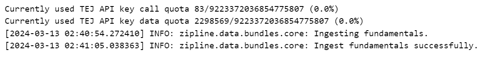

<span id="APIReference"></span>
# 6. API Reference
[Return to Menu](#menu)

### **class zipline.algo.pipeline_algo.<font color=DeepPink>TargetPercentPipeAlgo</font>** 
*(self, bundle_name='tquant', start_session=None, end_session=None, trading_calendar=get_calendar('TEJ_XTAI'),*

*capital_base=1e7, data_frequency='daily', tradeday=None, rebalance_date_rule=None, stocklist=None, benchmark='IR0001',* 

*zero_treasury_returns=True, slippage_model=slippage.VolumeShareSlippage(volume_limit=0.025, price_impact=0.1),*

*commission_model=commission.Custom_TW_Commission(min_trade_cost=20, discount = 1.0, tax = 0.003), max_leverage=0.8,* 

*limit_buy_multiplier=None, limit_sell_multiplier=None, allow_short=False, cancel_datedelta=None, custom_weight=False,*

*custom_loader=None, pipeline=None, analyze=None, record_vars=None, get_record_vars=False, get_transaction_detail=False,*

*order_filling_policy='next_bar')*

利用pipeline提供的買賣清單與持股權重進行定期再平衡的演算法。必要參數僅有`pipeline`。


#### Parameters:

- **bundle_name** (*str, optional*)－bundle名稱。預設是 **`'tquant'`**。  


- **start_session** (*pd.Timestamp or datetime, optional*)－回測起始日期。預設是**bundle中最早的資料日期**。  


- **end_session** (*pd.Timestamp or datetime, optional*)－回測結束日期。預設是**bundle中最晚的資料日期**。  


- **trading_calendar** (*TradingCalendar, optional*)－
  - 設置交易日曆。預設是 **`get_calendar('TEJ_XTAI')`**。
  - TradingCalendar：`zipline.utils.calendar_utils.TradingCalendar`。  


- **capital_base** (*float, optional*)－初始資金額度。預設是**一千萬**。  


- **data_frequency** (*{'daily', 'minute'}, optional*)－資料頻率，目前僅支援日頻率 **`'daily'`**。  


- **tradeday** (*list[str] or list[pd.Timestamp] or pd.DatetimeIndex, optional*)－
  - 交易日期清單，限制只能在這個清單中的日期進行交易。預設是**None**，代表**每日**都交易。
  - `rebalance_date_rule`與`tradeday`請擇一設定，若兩者皆設定，則會以`rebalance_date_rule`為主。  


- **rebalance_date_rule**(*EventRule, optional*)－
  - 交易頻率，設定固定的交易頻率。預設是**None**，代表**每日**都交易。
  - `rebalance_date_rule`與`tradeday`請擇一設定，若兩者皆設定，則會以`rebalance_date_rule`為主。
  - EventRule：`zipline.utils.events.EventRule`。可使用的`rebalance_date_rule`參考[zipline.api.date_rules](#date_rules)。  


- **stocklist** (*list[str], optional*)－交易清單，限制只能交易這個清單中的股票。預設是**None**，代表使用所有bundle中的股票。  


- **benchmark** (*str, optional*)－指數名稱，用來與投資組合報酬率比較。預設是`'IR0001'`，代表**台灣發行量加權股價報酬指數**。  


- **zero_treasury_returns** (*bool, optional*)－
  - 是否將無風險利率設定為0，預設是**True**，代表設定為0。因此使用`algo.run()`產出的回測報表中，`treasury_return`與`treasury_period_return`皆會是0。
  - 若設定為**False**，則會<font color=DeepPink>耗費額外API流量</font>，並取得第一銀行一年期定存利率作為無風險利率。  


- **slippage_model** (*SlippageModel, optional*)－
  - 設定滑價模型。預設為`slippage.VolumeShareSlippage(volume_limit=0.025, price_impact=0.1)`。可使用的模型參考：[lecture/Zipline Slippage.ipynb](https://github.com/tejtw/TQuant-Lab/blob/main/lecture/Zipline%20Slippage.ipynb)
  - SlippageModel：`zipline.finance.slippage.SlippageModel`。


- **commission_model** (*CommissionModel, optional*)－
  - 設定手續費模型。預設為`commission.Custom_TW_Commission(min_trade_cost=20, discount=1.0, tax = 0.003)`。可使用的模型參考：[lecture/Zipline Commission Models.ipynb](https://github.com/tejtw/TQuant-Lab/blob/main/lecture/Zipline%20Commission%20Models.ipynb)
  - CommissionModel：`zipline.finance.commission.CommissionModel`


- **max_leverage** (*float, optional*)－槓桿限制，預設 = **0.8**。  


- **limit_buy_multiplier** (*float, optional*)－
  - 買進／回補時的limit_price乘數，若有提供則limit_price = 下單時最近一筆收盤價 * `limit_buy_multiplier`。
  - 預設為**None**，代表**不設定**買進／回補時的limit_price。  


- **limit_sell_multiplier** (*float, optional*)－
  - 賣出／放空時的limit_price乘數，若有提供則limit_price = 下單時最近一筆收盤價 * `limit_sell_multiplier`。
  - 預設為**None**，代表**不設定**賣出／放空時的limit_price。  


- **allow_short** (*bool, optional*)－是否允許放空股票，預設為**False**，代表僅能做多。若設定為**True**，則pipeline中需要有`shorts`欄位。  


- **cancel_datedelta** (*int, optional*)－訂單幾天內未完全成交就取消。預設是在**下一次再平衡**時取消。 


- **custom_weight** (*bool, optional*)－
  - 是否要使用自訂的加權權數，預設為**False**，代表不使用（即等權重加權）。
  - 若設定為**True**，則pipeline中需要有`long_weights`（若`allow_short`=True，則也須有`short_weights`）欄位。


- **custom_loader** (*PipelineLoader , optional*)－
  - 用來取得價量以外資料，預設是**None**，代表不使用價量、`TQDataSet`與`TQAltDataSet`以外資料。
  - TQDataSet：`zipline.pipeline.data.TQDataSet`
  - TQAltDataSet：`zipline.pipeline.data.TQAltDataSet`
  - 目前支援的`PipelineLoader`：
    - DataFrameLoader（`zipline.pipeline.loaders.frame.DataFrameLoader`）。


- **pipeline** (*Pipeline*)－
  - 要用來產出交易清單或權重的pipeline，為<font color=DeepPink>**必要參數**</font>。
  - Pipeline：`zipline.pipeline.Pipeline`


- **analyze** (*callable[(context, pd.DataFrame) -> None], optional*)－
  - 傳入`analyze`函式以用於回測，函式中必須要有`context`與`perf`參數，預設是**None**。
  - 此函式在**回測結束**時被一次性呼叫，並繪製自訂圖表。


- **record_vars** (*callable[(context, BarData) -> None], optional*)－
  - 傳入`record_vars`函式以用於回測，函式中必須要有`context`與`data`參數，預設是**None**。
  - 此函式在**每個交易日結束**時被呼叫，並把指定資料紀錄於回測結果的DataFrame中。


- **get_record_vars** (*bool, optional*)－
  - 是否產出`record_vars`中`record`方法所記錄的變數，預設為**False**，代表不產出。
  - 若設定為**True**，則可用`algo.dict_record_vars`取出。


- **get_transaction_detail** (*bool, optional*)－
  - 是否產出交易結果，預設為**False**，代表不產出。
  - 若設定為**True**，則可用`algo.positions`、`algo.transactions`、`algo.orders`方式取出交易結果。


- **order_filling_policy** (*{'next_bar','current_bar'}, optional*)－
  - 設定交易方式，預設為**next_bar**，代表當天收盤後下單，隔一日收盤前成交，也就是原先的回測方式。
  - 若要當天開盤前下單，收盤前成交，則需指定設定為**current_bar**。

  
#### Returns:
    algo

#### Return type:
    zipline.algo.pipeline_algo.TargetPercentPipeAlgo


<br>


<br/>

**<font color=DeepPink>run</font>()**
>
> 執行演算法
> 
> **Returns:**
> - perf（回測報表）
> 
> **Return type:**
> - pd.DataFrame

<span id="date_rules"></span>
### **class zipline.api.<font color=DeepPink>date_rules</font>**
[Return to Menu](#menu)

- 為Factory API，主要用來傳入`zipline.api.schedule_function`的`date_rule`參數中。用來決定要以何種頻率觸發某項規則。
- 使用前請先import：`from zipline.api import date_rules`。
---

*static* **<font color=DeepPink>every_day</font>**()
> 
> 每日觸發某項規則。
> 
> **Returns:**
> - rule
> 
> **Return type:**
> - zipline.utils.events.EventRule

<br>

*static* **<font color=DeepPink>month_end</font>**(days_offset=0)
> 
> 每個月底觸發某項規則，並可以選擇性的新增一個偏移量。
> 
> **Parameters:**
> - **days_offset**(*int , optional*)：
>   - 在月底之前的第幾個交易日（由0開始計算）觸發某項規則。預設值是0，即在月底的最後一個交易日觸發。
>   - days_offset只能介於0~22之間。 
> 
> **Returns:**
> - rule
> 
> **Return type:**
> - zipline.utils.events.EventRule


<br>

*static* **<font color=DeepPink>month_start</font>**(days_offset=0)
> 
> 每個月初觸發某項規則，並可以選擇性的新增一個偏移量。
> 
> **Parameters:**
> - **days_offset**(*int , optional*)：
>   - 在月初之後的第幾個交易日（由0開始計算）才觸發某項規則。預設值是0，即在月初的第一個交易日觸發。
>   - days_offset只能介於0~22之間。 
> 
> **Returns:**
> - rule
> 
> **Return type:**
> - zipline.utils.events.EventRule


<br>

*static* **<font color=DeepPink>week_end</font>**(days_offset=0)
> 
> 在每周最後一個交易日觸發某項規則，並可以選擇性的新增一個偏移量。
> 
> **Parameters:**
> - **days_offset**(*int , optional*)：
>   - 在每周倒數第幾個交易日（由0開始計算）觸發某項規則。預設值是0，即在每周的最後一個交易日觸發。
>   - days_offset只能介於0~4之間。 
>
> **Returns:**
> - rule
> 
> **Return type:**
> - zipline.utils.events.EventRule


<br>

*static* **<font color=DeepPink>week_start</font>**(days_offset=0)
> 
> 在每周的第一個交易日觸發某項規則，並可以選擇性的新增一個偏移量。
> 
> **Parameters:**
> - **days_offset**(*int , optional*)：
>   - 在每周的第幾個交易日（由0開始計算）才觸發某項規則。預設值是0，即在每周的第一個交易日觸發。
>   - days_offset只能介於0~4之間。
> 
> **Returns:**
> - rule
> 
> **Return type:**
> - zipline.utils.events.EventRule

<span id="Examples"></span>
# 7. Examples
[Return to Menu](#menu)

```
from zipline.utils.algo_instance import get_algo_instance, set_algo_instance
from zipline.algo.pipeline_algo import TargetPercentPipeAlgo
```

<span id="Case1"></span>
## Case 1 調整start_session與end_session

[Return to Menu](#menu)

僅調整`start_session`與`end_session`。其餘保持預設值。

以下設定pipeline（`make_pipeline()`），並定義`longs`欄位用來判斷須持有的股票。在`longs`欄位中要持有的股票標記為True，反之標記為False。

```
from zipline.data import bundles

bundle = bundles.load(bundle_name)

def make_pipeline():
    rsi = RSI()
    longs = rsi.top(2, mask = ~SingleAsset(bundle.asset_finder.lookup_symbol('IR0001', as_of_date=None)))

    return Pipeline(
        
        columns = {
            "longs" : longs,
        }
    )
```
```
algo_start = '2023-09-21'
algo_start_dt = pd.Timestamp(algo_start, tz = tz)

result = run_pipeline(make_pipeline(), algo_start, end)
result.query('longs == True')
```
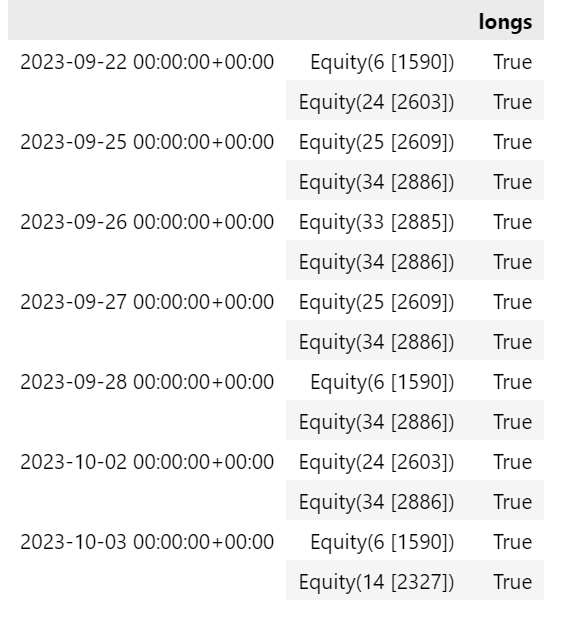

```
### 執行演算法
1. 實體化`TargetPercentPipeAlgo`並命名為`algo`。
2. 設定演算法：`set_algo_instance(algo)`
3. 執行演算法，並產出回測報表`stats`（*pd.DataFrame*）：`stats = algo.run()`
```

```
algo = TargetPercentPipeAlgo(
                     start_session=algo_start_dt,
                     end_session=end_dt,
                     pipeline=make_pipeline,
)

# set_algo_instance
set_algo_instance(algo)

# run
stats = algo.run()
```
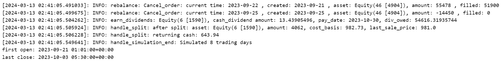

查看演算法中的參數設定

```
algo
```
```
stats.T
```

```
positions, transactions, orders = get_transaction_detail(stats)
```
```
transactions
```
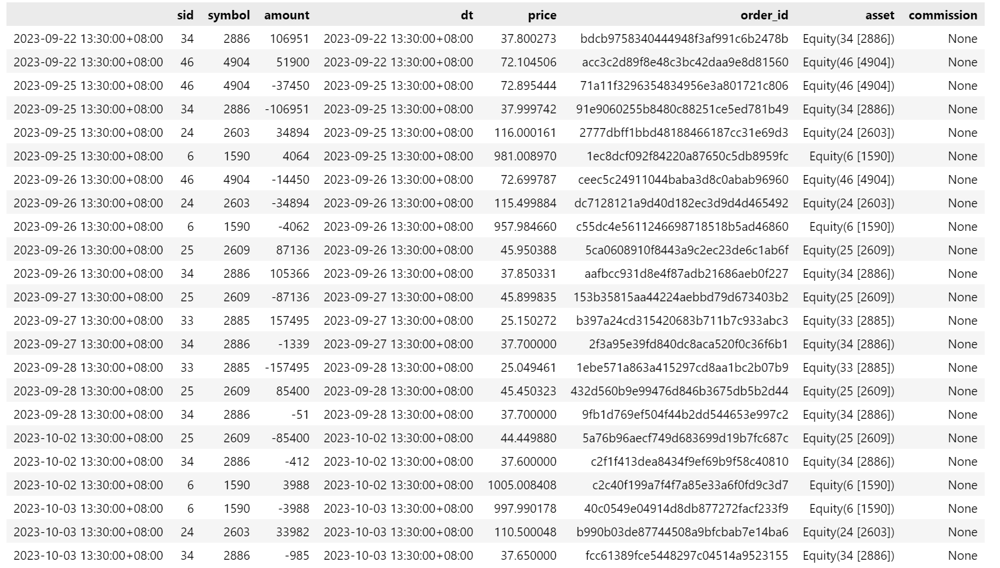

```
positions['mv'] = positions['amount'] * positions['last_sale_price']
positions
```
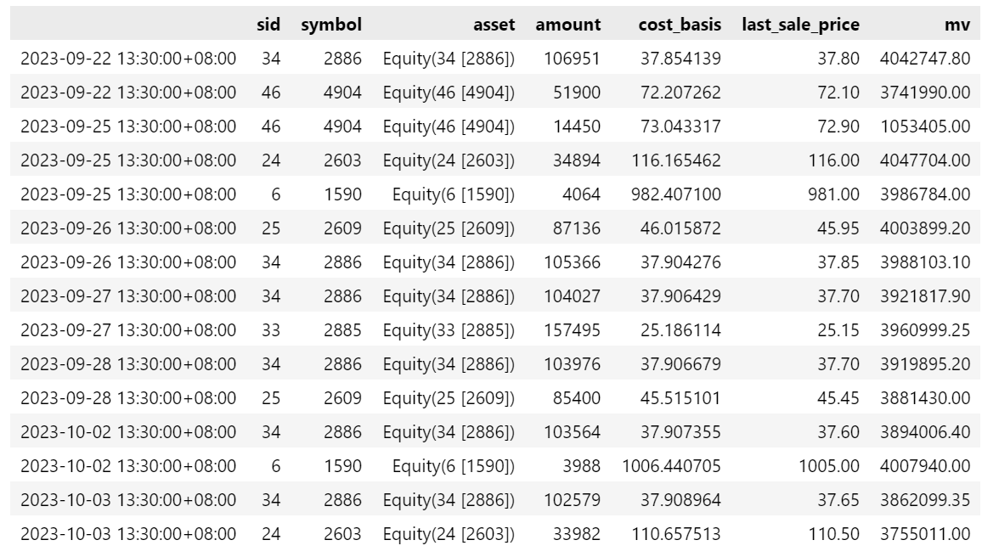

```
stats.neta_leverage

```
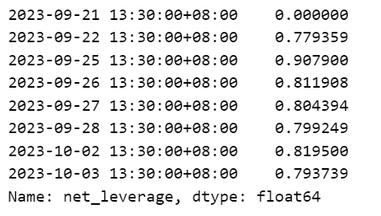

<span id="Case2"></span>
## Case 2 調整max_leverage
[Return to Menu](#menu)

接續**Case 1**，多調整`max_leverage=0.70`，其餘與**Case 1**相同。

```
algo = TargetPercentPipeAlgo(
                     start_session=algo_start_dt,
                     end_session=end_dt,
                     max_leverage=0.70,
                     pipeline=make_pipeline,
)

# set_algo_instance
set_algo_instance(algo)

# run
stats = algo.run()
```
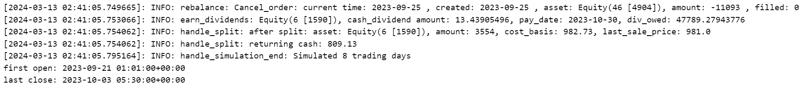

```
stats.net_leverage
```
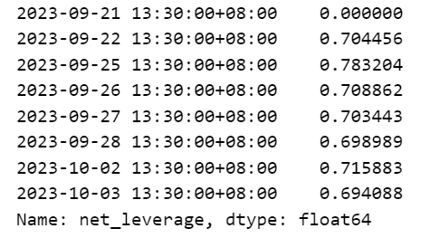

```
<span id="Case3"></span>
## Case 3 調整tradeday
[Return to Menu](#menu)  

接續**Case 1**，多新增`tradeday`，其餘與**Case 1**相同。
```
```
# 設定再平衡日期
freq = 'MS'   # QS-JUL  MS W
_tradeday = list(pd.date_range(start=start_dt, end=end_dt, freq=freq))
tradeday = [get_calendar(calendar_name).next_open(pd.Timestamp(i)).strftime('%Y-%m-%d') if \
           get_calendar(calendar_name).is_session(i)==False else i.strftime('%Y-%m-%d') for i in _tradeday]
tradeday
```
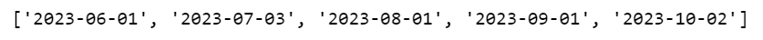

```
algo_staart_dt
```
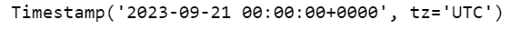

```
algo = TargetPercentPipeAlgo(
                     start_session=algo_start_dt,
                     end_session=end_dt,           
                     tradeday=tradeday,
                     pipeline=make_pipeline,
)

# set_algo_instance
set_algo_instance(algo)

# run
stats = algo.run()
```
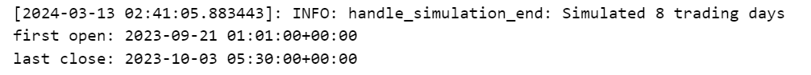

```
positions, transactions, orders = get_transaction_detail(stats)
```

```
transactions
```
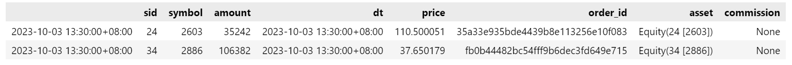

<span id="Case4"></span>
## Case 4 調整rebalance_date_rule
[Return to Menu](#menu)  

接續**Case 1**，多新增`rebalance_date_rule`，並修改`start_session`為2023-09-01，其餘與**Case 1**相同。

```
from zipline.api import date_rules

algo = TargetPercentPipeAlgo(
                     start_session=pd.Timestamp('2023-09-01', tz='UTC'),
                     end_session=end_dt,
                     pipeline=make_pipeline,
                     # 每月的第四個交易日下單
                     rebalance_date_rule=date_rules.month_start(days_offset=3) 
)

# set_algo_instance
set_algo_instance(algo)

# run
stats = algo.run()
```
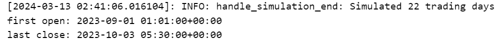

```
positions, transactions, orders = get_transaction_detail(stats)
```
```
orders
```
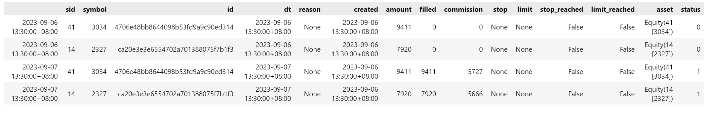
<span id="Case5"></span>
## Case 5 調整slippage_model
[Return to Menu](#menu)  

接續**Case 1**，多新增`slippage_model`，將`volume_limit`由**0.025**調整為**0.01**，其餘與**Case 1**相同。

```
algo = TargetPercentPipeAlgo(
                     start_session=algo_start_dt,
                     end_session=end_dt,
                     pipeline=make_pipeline,
                     slippage_model=slippage.VolumeShareSlippage(volume_limit=0.01, price_impact=0.1)
)

# set_algo_instance
set_algo_instance(algo)

# run
stats = algo.run()
```
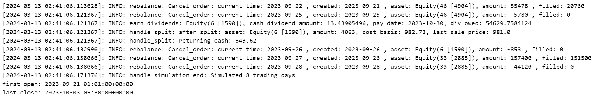

```
positions, transactions, orders = get_transaction_detail(stats)
```
```
orders.query('(symbol == "1590") & (created.dt.strftime("%Y-%m-%d") == "2023-09-25")')
```
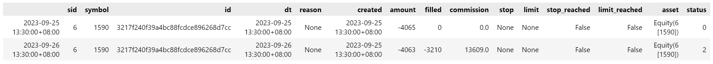

```
# 321000 * 1% = 3210(股) 

df_bundle_price.query('(symbol == "1590") & (date.dt.strftime("%Y-%m-%d") == "2023-09-26")')[['symbol','date','volume']]
```
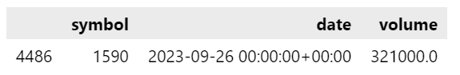

```
orders.query('(symbol == "2885") & (created.dt.strftime("%Y-%m-%d") == "2023-09-27")')
```
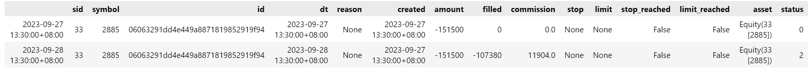

```
# 10738000 * 1% = 107380(股) 

df_bundle_price.query('(symbol == "2885") & (date.dt.strftime("%Y-%m-%d") == "2023-09-28")')[['symbol','date','volume']]
```
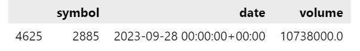

<span id="Case6"></span>
## Case 6 調整stocklist
[Return to Menu](#menu)  


接續**Case 1**，多新增`stocklist`，其餘與**Case 1**相同。  


註1：`stocklist`限制是在pipeline執行完後。  

註2：也可以使用pipeline直接限制股票池。
```
len(StockList)
```

```
_StockList = [i for i in StockList if i!='2886']
len(_StockList)
```
```
algo = TargetPercentPipeAlgo(
                     start_session=algo_start_dt,
                     end_session=end_dt,            
                     stocklist=_StockList,
                     pipeline=make_pipeline,
)

# set_algo_instance
set_algo_instance(algo)

# run
stats = algo.run()
```
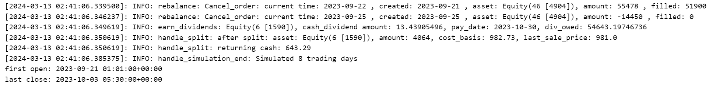

```
positions, transactions, orders = get_transaction_detail(stats)
```
```
positions
```
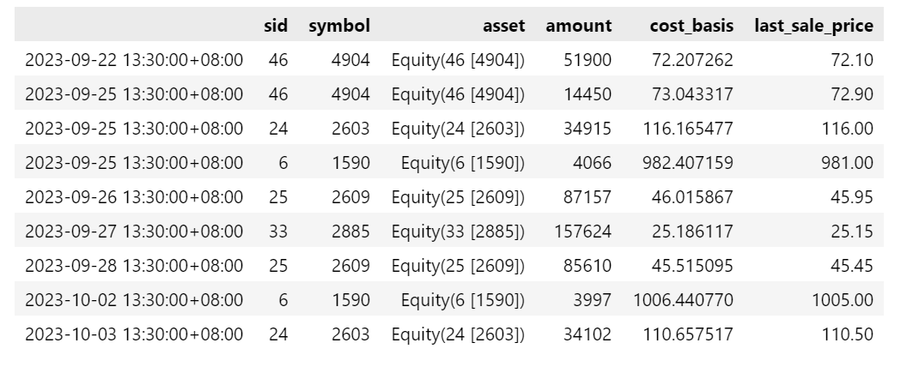

<span id="Case7"></span>
## Case 7 調整order_filling_policy
[Return to Menu](#menu) 

接續**Case 1**，多新增`order_filling_policy='current_bar'`，其餘與**Case 1**相同。

```
algo = TargetPercentPipeAlgo(
                     start_session=algo_start_dt,
                     end_session=end_dt,
                     pipeline=make_pipeline,
                     order_filling_policy='current_bar'
)

# set_algo_instance
set_algo_instance(algo)

# run
stats = algo.run()
```
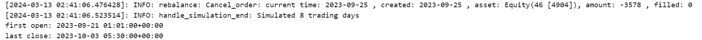

```
positions, transactions, orders = get_transaction_detail(stats)
```
```
result.loc['2023-09-22'].query('longs == True')
```
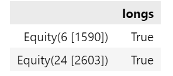

```
# 從`orders`中可以發現created=2023-09-22的單在當天就成交（status由0變為1）
orders.loc['2023-09-22']
```
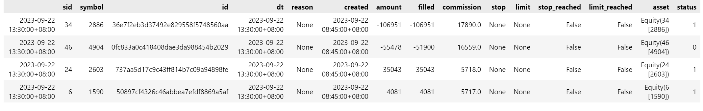

<span id="Case8"></span>
## Case 8 調整allow_short
[Return to Menu](#menu) 

接續**Case 1**，多新增`allow_short=True`，其餘與**Case 1**相同。  


以下設定pipeline（`make_pipeline()`），並定義`shorts`欄位用來判斷須放空的股票。在`shorts`欄位中要放空的股票標記為True，反之標記為False。

```
def make_pipeline():
    rsi = RSI()
    longs = rsi.top(2, mask = ~SingleAsset(bundle.asset_finder.lookup_symbol('IR0001', as_of_date=None)))
    shorts = rsi.bottom(2, mask = ~SingleAsset(bundle.asset_finder.lookup_symbol('IR0001', as_of_date=None)))

    return Pipeline(
        columns = {
            "longs" : longs,
            "shorts" : shorts
        }
    )
```
```
result = run_pipeline(make_pipeline(), algo_start, end)
result.query('(longs == True) | (shorts == True)' )
```
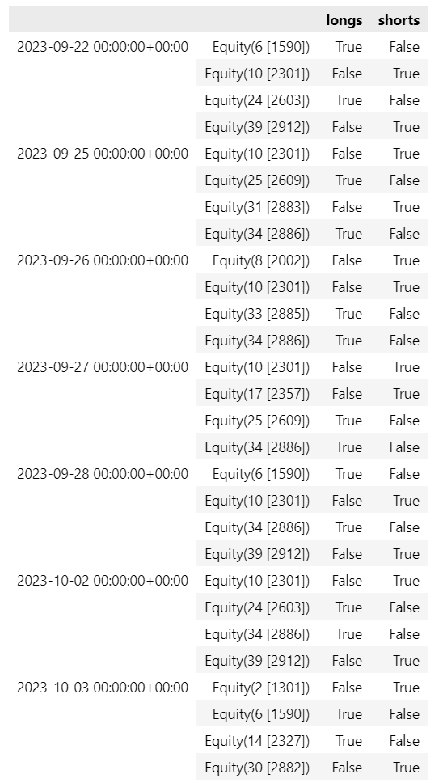

```
algo = TargetPercentPipeAlgo(
                     start_session=algo_start_dt,
                     end_session=end_dt,
                     allow_short=True,
                     pipeline=make_pipeline,
)

# set_algo_instance
set_algo_instance(algo)

# run
stats = algo.run()
```
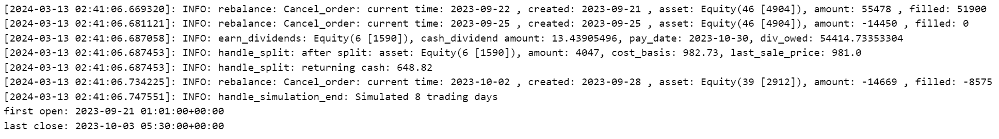

```
positions, transactions, orders = get_transaction_detail(stats)
```
```
# 當天取消
orders.query('(symbol == "2912") & (created.dt.strftime("%Y-%m-%d") == "2023-09-28")')
```
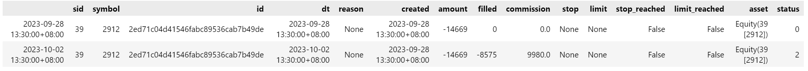

```
# 343000 * 2.5% = 8575(股) 

df_bundle_price.query('(symbol == "2912") & (date.dt.strftime("%Y-%m-%d") == "2023-10-02")')[['symbol','date','volume']]
```
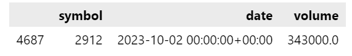

```
positions['mv'] = positions['amount'] * positions['last_sale_price']
positions.query('(symbol == "2912")')
```
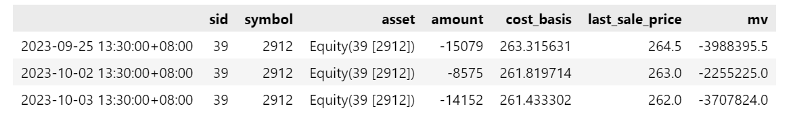

<span id="Case9"></span>
## Case 9 調整cancel_datedelta
[Return to Menu](#menu) 

接續**Case 8**，多新增`cancel_datedelta=2`，其餘與**Case 8**相同。  

```
algo = TargetPercentPipeAlgo(
                     start_session=algo_start_dt,
                     end_session=end_dt,
                     allow_short=True,
                     cancel_datedelta=2,
                     pipeline=make_pipeline,
)

# set_algo_instance
set_algo_instance(algo)

# run
stats = algo.run()
```
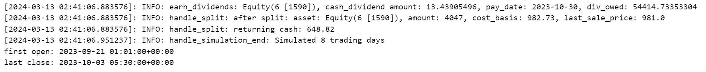

```
result = run_pipeline(make_pipeline(), algo_start, end)
result.query('(longs == True) | (shorts == True)' )
```
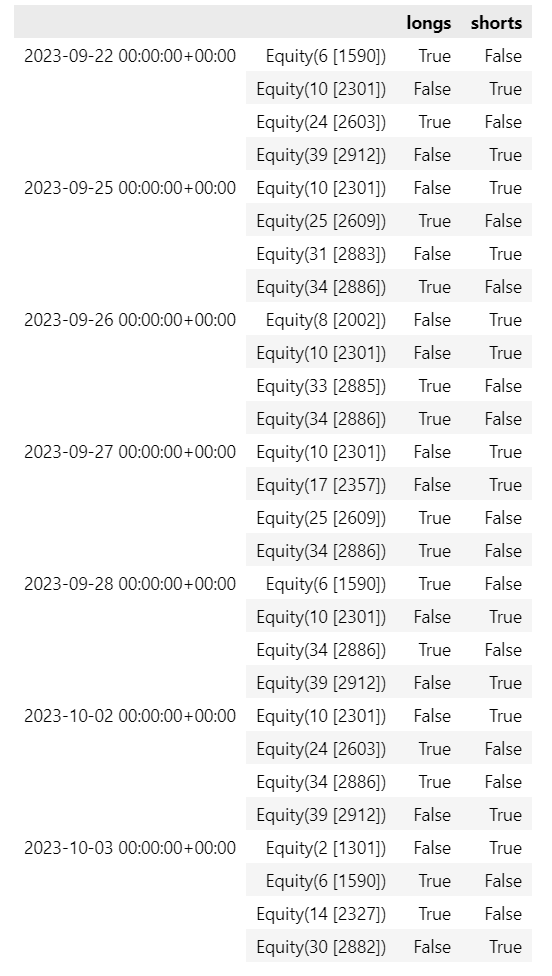

```
positions, transactions, orders = get_transaction_detail(stats)
```
```
orders.query('(symbol == "2912") & (created.dt.strftime("%Y-%m-%d") == "2023-09-28")')
```
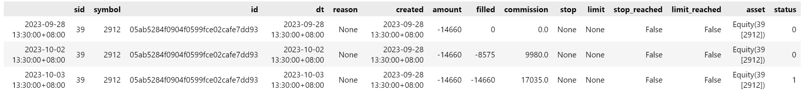

```
# 10/02：343000 * 2.5% = 8575(股) 
# 10/03：808000 * 2.5% = 20200(股) 

df_bundle_price.query('(symbol == "2912") & (date.dt.strftime("%Y-%m-%d")>="2023-10-02")')\
                 [['symbol','date','volume']]
```
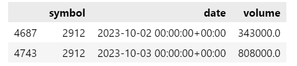

```
positions['mv'] = positions['amount'] * positions['last_sale_price']
positions.query('(symbol == "2912")')
```
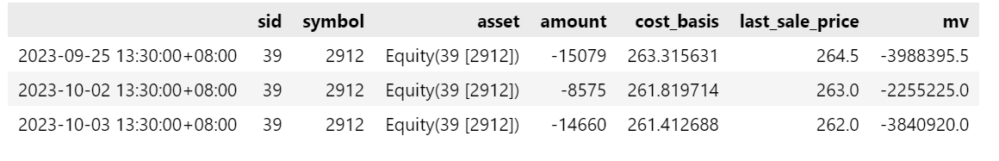

<span id="Case10"></span>
## Case 10 調整limit_buy_multiplier
[Return to Menu](#menu) 

接續**Case 9**，多設定`limit_buy_multiplier=1.015`，其餘與**Case 9**相同。

```
result = run_pipeline(make_pipeline(), algo_start, end)
result.query('(longs == True) | (shorts == True)' )
```


```
algo = TargetPercentPipeAlgo(
                     start_session=algo_start_dt,
                     end_session=end_dt,
                     limit_buy_multiplier=1.015,
                     allow_short=True,
                     cancel_datedelta=2,
                     pipeline=make_pipeline,
)

# set_algo_instance
set_algo_instance(algo)

# run
stats = algo.run()
```
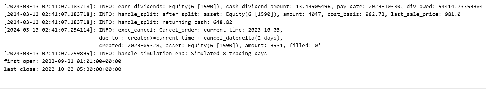
```
positions, transactions, orders = get_transaction_detail(stats)
```
```
orders
```
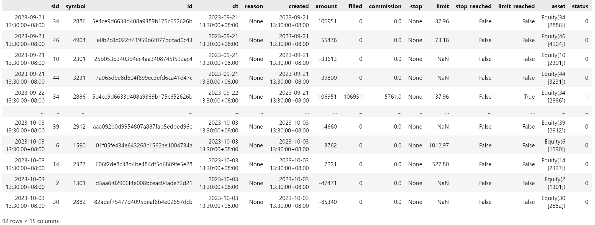
```
orders.query('(symbol == "1590") & (created.dt.strftime("%Y-%m-%d") == "2023-09-28")')
```
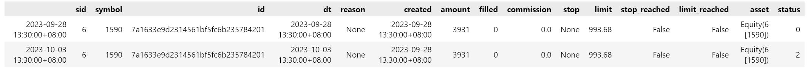

```
# 9/28 979 * 1.015 = 993.685
df_bundle_price.query('(symbol == "1590") & (date.dt.strftime("%Y-%m-%d")>="2023-09-28")')\
                 [['symbol','date','close']]
```
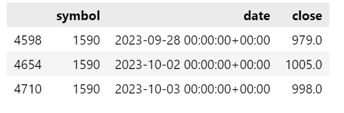

<span id="Case11"></span>
## Case 11 調整custom_weight、analyze、record_vars、get_record_vars與get_transaction_detail
[Return to Menu](#menu) 

接續**Case 10**，多設定`custom_weight`=True、`analyze`、`record_vars`、`get_record_vars`=True與`get_transaction_detail`=True，其餘與**Case 10**相同。

```
class Weight(CustomFactor):
    
    inputs =  [TQAltDataSet.Market_Cap_Dollars] 
    outputs = ["Market_Cap_Dollars","Sum_Market_Cap_Dollars","Weight"]   
    window_length = 1

    def compute(self, today, assets, out, Market_Cap_Dollars):
        
        out.Market_Cap_Dollars[:] = Market_Cap_Dollars
        out.Sum_Market_Cap_Dollars[:] = np.nansum(Market_Cap_Dollars, axis=1)
        out.Weight[:] = Market_Cap_Dollars / np.sum(Market_Cap_Dollars, axis=1)
```
```
def make_pipeline():
    
    rsi = RSI()
    longs = rsi.top(2, mask = ~SingleAsset(bundle.asset_finder.lookup_symbol('IR0001', as_of_date=None)))
    shorts = rsi.bottom(2, mask = ~SingleAsset(bundle.asset_finder.lookup_symbol('IR0001', as_of_date=None)))

    return Pipeline(
        
        columns = {
            "Market_Cap_Dollars":Weight().Market_Cap_Dollars,        
            "longs" : longs,
            "shorts" : shorts,
            "long_weights" : Weight(mask=longs).Weight,
            "short_weights" : Weight(mask=shorts).Weight
        }
    )
```
```
def analyze(context, perf):
    
    fig = plt.figure(figsize=(16, 24), dpi=400)
    
    # First chart(累積報酬)
    ax = fig.add_subplot(611) 
    ax.set_title('Strategy Results') 
    ax.plot(perf['algorithm_period_return'],
            linestyle='-', 
            label='algorithm period return',
            linewidth=3.0)
    ax.plot(perf['benchmark_period_return'],
            linestyle='-', 
            label='benchmark period return',
            linewidth=3.0)
    ax.legend()
    ax.grid(False)
    
    # Second chart(returns)
    ax = fig.add_subplot(612, sharex=ax)       
    ax.plot(perf['returns'],
            linestyle='-', 
            label='returns',
            linewidth=3.0)
    ax.legend()
    ax.grid(False)

    # Third chart(ending_cash) -> 觀察是否超買
    ax = fig.add_subplot(613, sharex=ax)
    ax.plot(perf['ending_cash'], 
            label='ending_cash',
            linestyle='-',
            linewidth=3.0)
    ax.axhline(y=1, c='r', linewidth=1)
    ax.legend()
    ax.grid(False)

    # Forth chart(shorts_count) -> 觀察是否放空
    ax = fig.add_subplot(614, sharex=ax)
    ax.plot(perf['shorts_count'], 
            label='shorts_count',
            linestyle='-',
            linewidth=3.0)
    ax.yaxis.set_major_locator(MaxNLocator(integer=True))
    ax.axhline(y=0, c='r', linewidth=1)
    ax.legend()
    ax.grid(False)
    
    # Fifth chart(longs_count)
    ax = fig.add_subplot(615, sharex=ax)
    ax.plot(perf['longs_count'], 
            label='longs_count',
            linestyle='-',
            linewidth=3.0)
    ax.yaxis.set_major_locator(MaxNLocator(integer=True))
    ax.axhline(y=0, c='r', linewidth=1)
    ax.legend()
    ax.grid(False) 
    
    # Sixth chart(weights) -> 觀察每日持股權重
    ax = fig.add_subplot(616, sharex=ax)        
    weights = pd.concat([df.to_frame(d) for d, df in perf['daily_weights'].dropna().items()],axis=1).T
    
    for i in weights.columns:
        df = weights.loc[:,i]
        ax.scatter(df.index,df.values,marker='.', s=5, c='grey', label='daily_weights')
    ax.axhline(y=0, c='r', linewidth=1)
    ax.legend(['daily_weights'])
    ax.grid(False)

    fig.tight_layout()

def record_vars(context, data):
    """
    Plot variables at the end of each day.
    """
            
    record(daily_weights=context.daily_weights,
           Market_Cap_Dollars=context.output.Market_Cap_Dollars
          )def analyze(context, perf):
    
    fig = plt.figure(figsize=(16, 24), dpi=400)
    
    # First chart(累積報酬)
    ax = fig.add_subplot(611) 
    ax.set_title('Strategy Results') 
    ax.plot(perf['algorithm_period_return'],
            linestyle='-', 
            label='algorithm period return',
            linewidth=3.0)
    ax.plot(perf['benchmark_period_return'],
            linestyle='-', 
            label='benchmark period return',
            linewidth=3.0)
    ax.legend()
    ax.grid(False)
    
    # Second chart(returns)
    ax = fig.add_subplot(612, sharex=ax)       
    ax.plot(perf['returns'],
            linestyle='-', 
            label='returns',
            linewidth=3.0)
    ax.legend()
    ax.grid(False)

    # Third chart(ending_cash) -> 觀察是否超買
    ax = fig.add_subplot(613, sharex=ax)
    ax.plot(perf['ending_cash'], 
            label='ending_cash',
            linestyle='-',
            linewidth=3.0)
    ax.axhline(y=1, c='r', linewidth=1)
    ax.legend()
    ax.grid(False)

    # Forth chart(shorts_count) -> 觀察是否放空
    ax = fig.add_subplot(614, sharex=ax)
    ax.plot(perf['shorts_count'], 
            label='shorts_count',
            linestyle='-',
            linewidth=3.0)
    ax.yaxis.set_major_locator(MaxNLocator(integer=True))
    ax.axhline(y=0, c='r', linewidth=1)
    ax.legend()
    ax.grid(False)
    
    # Fifth chart(longs_count)
    ax = fig.add_subplot(615, sharex=ax)
    ax.plot(perf['longs_count'], 
            label='longs_count',
            linestyle='-',
            linewidth=3.0)
    ax.yaxis.set_major_locator(MaxNLocator(integer=True))
    ax.axhline(y=0, c='r', linewidth=1)
    ax.legend()
    ax.grid(False) 
    
    # Sixth chart(weights) -> 觀察每日持股權重
    ax = fig.add_subplot(616, sharex=ax)        
    weights = pd.concat([df.to_frame(d) for d, df in perf['daily_weights'].dropna().items()],axis=1).T
    
    for i in weights.columns:
        df = weights.loc[:,i]
        ax.scatter(df.index,df.values,marker='.', s=5, c='grey', label='daily_weights')
    ax.axhline(y=0, c='r', linewidth=1)
    ax.legend(['daily_weights'])
    ax.grid(False)

    fig.tight_layout()

def record_vars(context, data):
    """
    Plot variables at the end of each day.
    """
            
    record(daily_weights=context.daily_weights,
           Market_Cap_Dollars=context.output.Market_Cap_Dollars
          )
```

```
algo = TargetPercentPipeAlgo(
                     start_session=algo_start_dt,
                     end_session=end_dt,
                     limit_buy_multiplier=1.015,
                     allow_short=True,
                     custom_weight=True,
                     cancel_datedelta=2,
                     pipeline=make_pipeline,
                     analyze=analyze,
                     record_vars=record_vars,
                     get_record_vars=True,
                     get_transaction_detail=True
)

# set_algo_instance
set_algo_instance(algo)

# run
stats = algo.run()
```